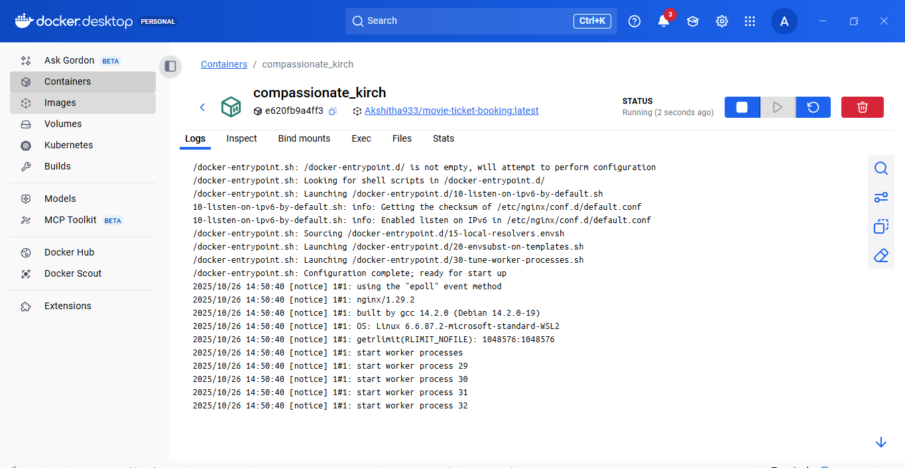
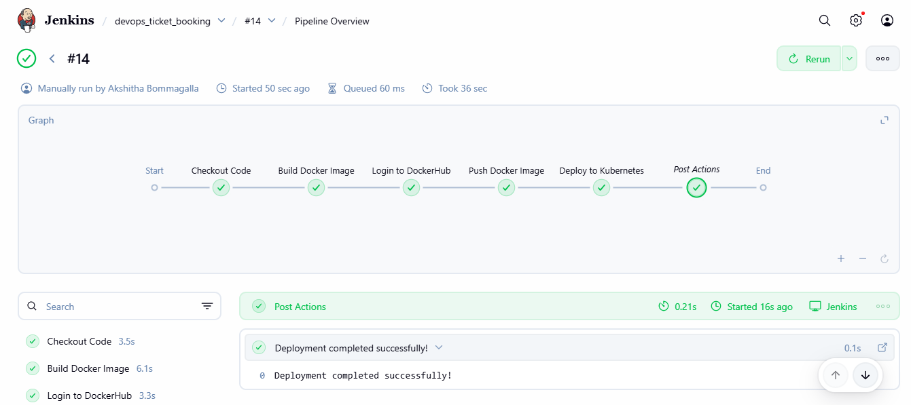
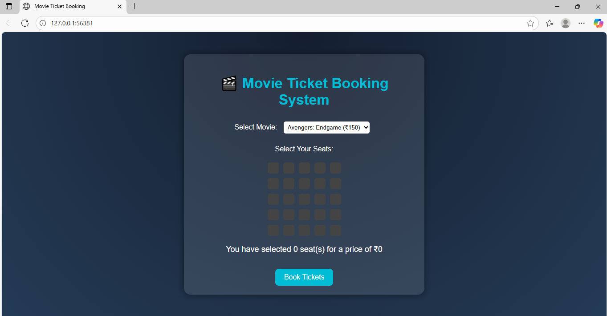
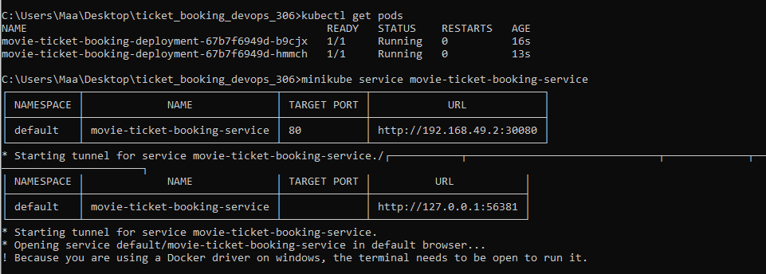

Movie Ticket Booking Web App – DevOps Assignment

Tech Stack:
- HTML,CSS, JavaScript (Basic froNtend code)
- Docker
- Jenkins
- Kubernetes (Minikube)
- Git & GitHub
- Docker Hub

Project Description:
This project is a web-based movie ticket booking application. 
It demonstrates a complete DevOps workflow including version control, containerization, continuous integration and deployment, and Kubernetes orchestration.
The app is deployed using Docker and Kubernetes, and the workflow is automated with Jenkins CI/CD pipeline.

Simple Steps to Run the Project:

1. Clone the repository
2. Build Docker Image
3. Run Docker Container Locally
4. Push Image to Docker Hub
5. Deploy on Kubernetes
kubectl apply -f deployment.yaml
kubectl apply -f service.yaml
6. Access the Service

Key Steps:

Version Control and Branching
- Initialize Git repository
- Use GitFlow branching strategy for features and production-ready code

Docker Containerization
- Create Dockerfile specifying environment and app files
- Build and test Docker image locally
- Push image to Docker Hub for deployment

CI/CD Pipeline using Jenkins
- Configure Jenkins pipeline with stages:
  1. Checkout code
  2. Build Docker image
  3. Push to Docker Hub
  4. Deploy to Kubernetes
- Automatically triggers pipeline on code push

Kubernetes Deployment
- deployment.yaml defines app deployment, replicas, and container image
- service.yaml exposes the app to browser
- Scale app by increasing replicas in deployment

Screenshots

1. Docker Build and Run

2. Jenkins Pipeline Build

3. Application in Browser

4. Terminal running container

Conclusion :
This project demonstrates a full DevOps workflow for a web application using Docker, Jenkins, and Kubernetes. 
It shows how frontend applications can be containerized, deployed, and scaled in a practical environment.
